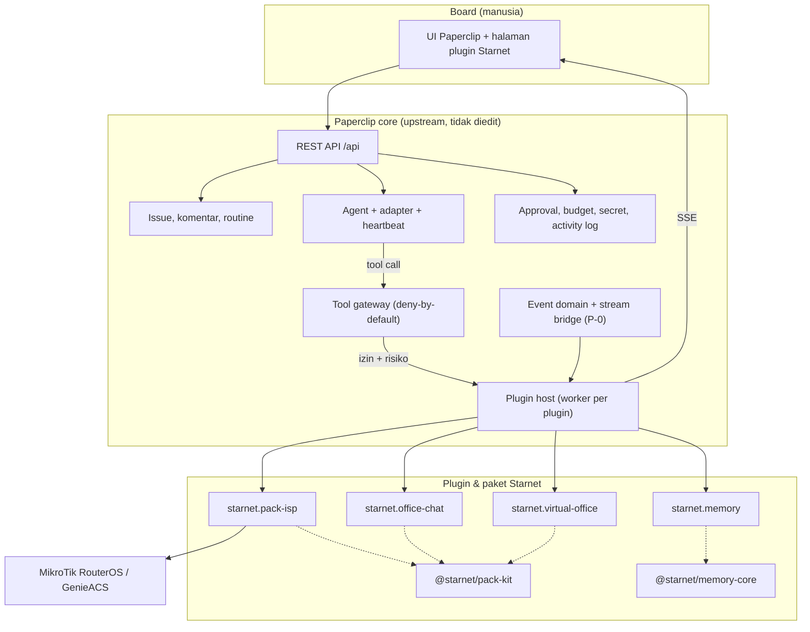
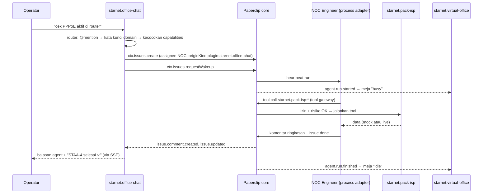

# 2. Arsitektur

## 2.1 Gambaran besar

Paperclip adalah **control plane**. Starnet adalah **lapisan domain** yang dipasang sebagai plugin. Agent Starnet
berjalan lewat adapter Paperclip dan memanggil tool Starnet lewat tool gateway Paperclip.

## 2.2 Pemetaan konsep: Starnet Office → Paperclip

| Konsep Starnet Office | Primitive Paperclip | Catatan |
|---|---|---|
| Organization (tenant) | **Company** | Satu instance, banyak company; semua entitas dibatasi company |
| Office / `AgentGroup` | Company (atau sub-tim di org chart) | Demo memakai satu company "Starnet Demo" sebagai satu kantor |
| Agent + `roleKey` | **Agent** (adapter + config, title, reporting line, capabilities) | Paperclip tidak mengunci 9 `roleKey`; identitas ada di title/capabilities |
| Task, subtask, dependency | **Issue**, sub-issue, blocker | Single assignee, checkout atomik |
| Discussion task | **Komentar issue** | Balasan agent di Office Chat diambil dari komentar issue |
| AgentRun | **Heartbeat run** | Event `agent.run.started/finished/failed/cancelled` |
| Tool pipeline (ADR-001) | **Tool gateway** + tool profile + tool policy | Risiko ditebak dari nama tool (lihat 2.6) |
| Approval HIGH/CRITICAL (ADR-002) | Tool policy `require_approval` → action request | Board menyetujui di UI Paperclip |
| Kredensial terenkripsi | **Company secret** + secret-ref | Plugin me-resolve per panggilan, tidak pernah menyimpan |
| Scheduler | **Routine** (cron, zona waktu, catch-up policy) | Contoh: Daily PPPoE check 07:00 WIB |
| Budget org | Budget company/agent dengan hard-stop | Bawaan core |
| Audit log | **Activity log** + audit tool gateway | Bawaan core |
| Realtime SSE | Event domain → worker plugin → stream bridge SSE | Butuh patch P-0 |
| Memory L1–L4 | Plugin `starnet.memory` (DB namespace plugin) | Agent menarik context pack; tidak bisa disuntik ke prompt |
| Knowledge base (LightRAG) | Belum dipetakan | Lihat [peta migrasi](./03-peta-migrasi.md) |

## 2.3 Paket Starnet

| Paket | Jenis | Isi |
|---|---|---|
| `packages/plugins/starnet-pack-isp` (`starnet.pack-isp`) | Plugin | 4 tool read-only (MikroTik, GenieACS), agent **NOC Engineer** (adapter `process`, skrip deterministik `agent/noc-check.mjs`, tanpa LLM), routine **Daily PPPoE check**, widget NOC status |
| `packages/plugins/starnet-office-chat` (`starnet.office-chat`) | Plugin UI | Halaman chat company; permintaan jadi issue untuk agent yang tepat |
| `packages/plugins/starnet-virtual-office` (`starnet.virtual-office`) | Plugin UI | Meja agent dengan status live, widget dashboard |
| `packages/plugins/starnet-memory` (`starnet.memory`) | Plugin | Memory L1, pin, filter tulis, context pack, halaman Memori |
| `packages/plugins/starnet-pack-kit` (`@starnet/pack-kit`) | Library | Helper bersama: cek risiko nama tool, `fetchJson` dengan timeout, label mock, `serialByKey` |
| `packages/starnet-memory-core` (`@starnet/memory-core`) | Library murni | Admission, scrub secret, deteksi poisoning, ringkasan L1 deterministik, bundle berbudget |
| `packages/starnet-devkit` (`@starnet/devkit`) | Tooling | Seed demo, server palsu RouterOS/GenieACS, E2E, sync upstream, `core-diff-check` |
| `packages/starnet-docs` | Dokumentasi | Folder ini |

## 2.4 Alur utama

### a. Office Chat → issue → agent → balasan

Prinsip penting:

- **Isolasi peran.** Deskripsi issue hanya berisi satu permintaan itu. Agent tidak melihat transkrip chat atau tugas
  agent lain.
- **Chat bukan system of record.** Pekerjaan tercatat sebagai issue, run, tool call, dan komentar di core.
- **Sesi chat Paperclip (`agent.sessions.*`) sengaja tidak dipakai**, karena melewati issue, assignment, dan audit.

### b. Routine harian

Routine `Daily PPPoE check` (cron `0 7 * * *`, `Asia/Jakarta`) membuat issue untuk NOC Engineer. NOC memanggil 4 tool,
menulis satu komentar ringkasan, menutup issue, dan menyimpan snapshot ke plugin state untuk widget NOC. Scheduler
memeriksa routine setiap 30 detik, jadi start bisa terlambat sampai sekitar 30 detik dari menit cron.

### c. Memory: context pack

1. Setelah run selesai, `starnet.memory` menerima `agent.run.finished/failed/cancelled` dan menulis ringkasan L1
   deterministik per agent+issue dan per agent. Hook ini hanya mengamati; tidak mengubah core.
2. Board menyimpan fakta lewat komentar (`catat: …`, `📌 …`, `/pin …`, `pin: …`, `ingat: …`) atau form di UI Memori.
3. Setiap tulisan melewati filter `admit()`: secret disensor; teks yang isinya hanya secret, transkrip mentah, atau
   terlalu panjang ditolak; percobaan poisoning dikarantina sampai board menyetujui.
4. Saat bekerja, agent **menarik** context pack: `GET /api/plugins/starnet.memory/api/context/:issueId?tools=…`
   (auth token run, butuh checkout) atau tool `memory.get_context_bundle`.
5. Pack dibungkus `<starnet-context v="1">` dengan budget total 5.500 karakter. Contoh terukur: 665 karakter
   (sekitar 167 token) dibanding riwayat naif 11.906 karakter, 94,4% lebih kecil.

## 2.5 Mode mock dan live

Setiap sumber (MikroTik, GenieACS) berjalan **mock** sampai host-nya dikonfigurasi. Hasil mock selalu diawali
`[MOCK DATA — no device configured]`. Mode live memakai HTTP sungguhan dengan timeout (default 8 detik), dan pesan
error hanya memuat origin dan path, tanpa kredensial. Devkit menyediakan server palsu untuk menguji jalur live tanpa
perangkat asli.

## 2.6 Model keamanan

| Lapisan | Mekanisme |
|---|---|
| Akses tool | Tool gateway **deny-by-default**. Plugin tidak bisa memberi akses tool ke agent; board membuat tool profile (`defaultAction: deny`, hanya tool yang diizinkan) dan mem-bind-nya ke agent |
| Kredensial | Password disimpan sebagai company secret. Config plugin hanya memuat `{ "type": "secret_ref", "secretId": … }`. Worker me-resolve per panggilan, tidak menyimpan atau mencatat nilainya |
| Least privilege | Agent NOC dibuat dengan `canCreateAgents: false`, `canCreateSkills: false`; seed juga mematikan `canAssignTasks` |
| Risiko tool | Gateway menebak risiko **dari nama tool saja** (`inferToolRisk`). Kata kerja tulis/destruktif wajib ada di nama tool yang mengubah perangkat (mis. `mikrotik.apply_reboot`). `assertGatewayRisk` di pack-kit membuat worker crash kalau nama tool menurunkan risiko |
| Approval tulis (rencana) | Tool tulis di-bind lewat profile terpisah + tool policy `require_approval` untuk `write/destructive`, ditambah `allowWrites: true` per company di config plugin |
| Memory | Scrub secret dua kali, karantina poisoning, tidak menyimpan transkrip |
| Devkit | Hanya bicara REST ke loopback; membuang `DATABASE_URL`; state rahasia di `.state/` (0600, gitignored) |

Catatan: di Paperclip, **skill company terbuka secara default** (skill bukan objek berhak istimewa). Ini selaras dengan
invariant Starnet "skill ≠ permission", karena izin tool tetap diatur tool gateway, bukan skill.

## 2.7 Kemampuan dan batas plugin SDK Paperclip

Yang dipakai Starnet:

- **Slot UI:** `page`, `sidebar`, `dashboardWidget`, `detailTab` (dari 17 slot yang tersedia).
- **Hook UI:** `usePluginData`, `usePluginAction`, `usePluginStream`, komponen host seperti `MarkdownBlock`.
- **Event (observe-only):** 33 event domain, misalnya `issue.*`, `issue.comment.created`, `agent.run.*`,
  `approval.*`. Handler tidak bisa memblokir atau mengubah aksi core.
- **Lainnya:** plugin state, DB namespace plugin, managed agent dan routine, tool, secret-ref, route API plugin.

Batas yang sudah ditemui:

| Batas | Dampak | Penanganan |
|---|---|---|
| Stream bridge tidak tersambung di upstream (501) | UI live tidak jalan | Patch core P-0; polling 2,5 detik sebagai fallback |
| Issue buatan plugin tidak otomatis dibangunkan | Agent tidak mulai kerja | Plugin memanggil `ctx.issues.requestWakeup` |
| Plugin tidak bisa menyuntik teks ke prompt adapter lain | Penghematan token belum penuh | Agent menarik context pack; penuh setelah runtime adapter Starnet (Fase 2) |
| Slot `detailTab` agent tidak dirender | Tab Memori agent tidak tampil | Tampilan "Memori per agen" di halaman Memori |
| Core memancarkan `agent.run.*` sebelum status agent kembali idle | Meja bisa tertinggal "busy" | Virtual Office mengumumkan ulang pada +1,5 dan +5 detik |
| Tidak ada field `risk` eksplisit untuk tool plugin | Tool seperti `reboot` dianggap `read` | Aturan penamaan + usulan PR upstream |

Daftar lengkap kandidat PR upstream ada di [`STARNET_PATCHES.md`](../../STARNET_PATCHES.md).
